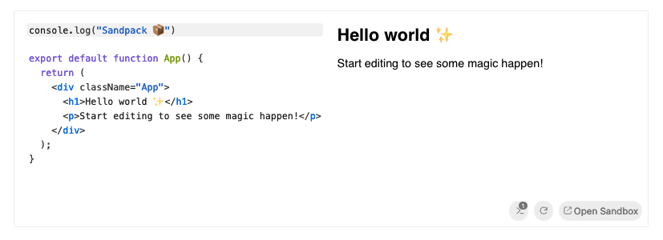

# little ide

As we can see thanks to stackblizt and codesandbox, more and more code editors are going to be run on the brower.

codesandbox have even created a project named 
[sandpack](https://sandpack.codesandbox.io/). Sandpack even embed a code editor for the convenience of having it and modifying interactive code (react.dev use it for instance).

here is an visual example of it

For me we can defined thoses ide as "little ide" because they help use preview and modify code in a small scale but don't have the same features as a full ide such as vscode or jetbrains ones.

I really think there is a spot for little ide, and that it will comes more and more even in our local development.

Little ide could use in rich text editor such as notion and more. Because coding, researching explaining are not the same thing and may finally have different tools.